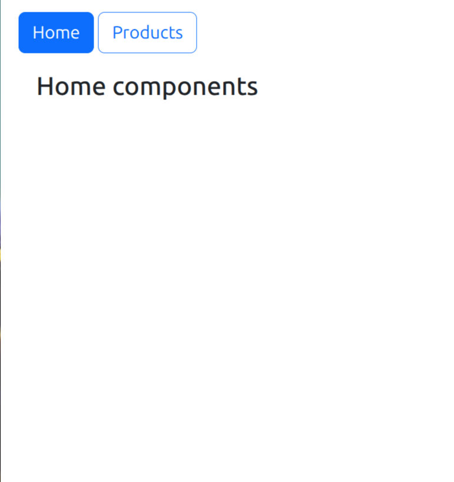
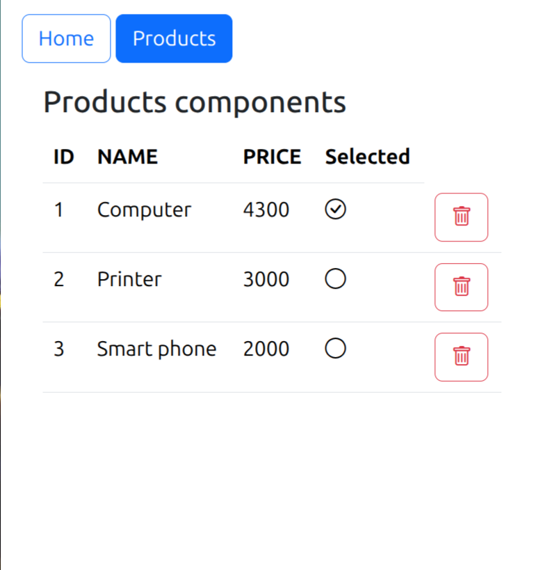
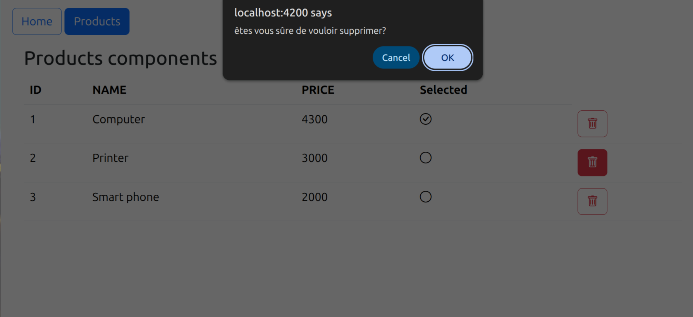
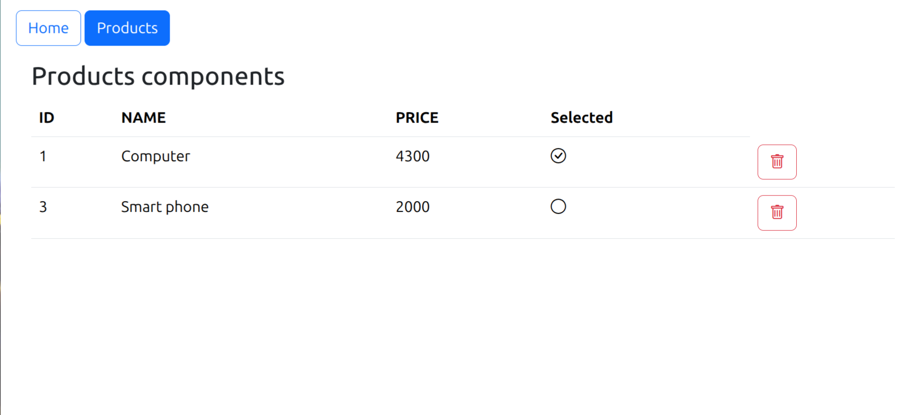
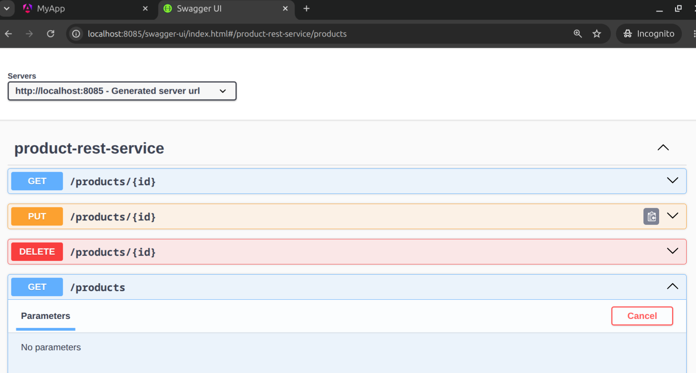
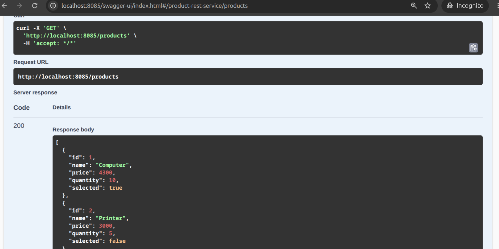

# Angular Framework

## Présentation

Ce projet est une application web construite avec **Angular**, qui consomme une API REST développée en **Spring Boot** (projet 
[`Spring-Data-JPA-Hibernate`](https://github.com/elmehdi-elmais/Spring-Data-JPA-Hibernate/tree/backend-angular?authuser=0)
). Elle permet d'afficher, sélectionner et supprimer des produits.

L'objectif est de comprendre les bases d'Angular : composants, services, routing, injection de dépendances, et communication avec une API backend via HTTP.

## Technologies utilisées

- **Angular** (v22)
- **TypeScript**
- **Bootstrap** : mise en forme de l'interface
- **Bootstrap Icons** : icônes (coche, poubelle...)
- **HttpClient** : pour communiquer avec l'API REST Spring Boot
- **Signals** : gestion native et réactive de l'état des données

## Structure du projet

```
src/app/
├── home/
│   └── home.ts / home.html
├── products/
│   ├── products.ts        → composant qui affiche la liste des produits
│   ├── products.html
│   └── products.css
├── services/
│   └── product.ts          → service qui appelle l'API REST (getAllProducts, deleteProduct)
├── app.ts                   → composant racine
├── app.html                  → template racine (navbar + router-outlet)
├── app.routes.ts              → configuration des routes
└── app.config.ts               → configuration globale de l'application
```

## Le service `Product`

```typescript
@Service()
export class Product {
  getAllProducts() {
    return this.http.get<any[]>('http://localhost:8085/products');
  }

  deleteProduct(product: any) {
    return this.http.delete(`http://localhost:8085/products/${product.id}`);
  }
}
```

Ce service centralise tous les appels HTTP vers l'API. Les composants ne parlent jamais directement au backend — ils passent toujours par ce service, injecté via le constructeur.

## Le composant `Products`

Ce composant utilise les **Signals**, la façon moderne et native d'Angular de gérer des données qui changent dans le temps :

```typescript
export class Products implements OnInit {
  products = signal<Array<any>>([]);

  ngOnInit() {
    this.product.getAllProducts().subscribe({
      next: (data) => {
        this.products.set(data);
      }
    });
  }
}
```

### Pourquoi les Signals ?

Un Signal notifie automatiquement Angular quand sa valeur change, sans avoir besoin de la librairie Zone.js. C'est plus simple, plus rapide, et ça fonctionne de façon fiable même avec des données qui arrivent de manière asynchrone (comme une réponse HTTP).

Dans le template, un signal s'utilise avec des parenthèses, car c'est en réalité une fonction :

```html
@for (p of products(); track p.id) {
  <tr>
    <td>{{ p.name }}</td>
  </tr>
}
```

## Affichage avec la nouvelle syntaxe de contrôle

Angular propose maintenant `@if` et `@for` directement dans le HTML (plus besoin de `*ngIf` ou `*ngFor`) :

```html
 
  <table class="table">
    @for (p of products(); track p.id) {
      <tr>
        <td>{{ p.id }}</td>
        <td>{{ p.name }}</td>
        <td>{{ p.price }}</td>
        <td>
          @if (p.selected) {
            <i class="bi bi-check-circle"></i>
          } @else {
            <i class="bi bi-circle"></i>
          }
        </td>
        <td>
          <button (click)="handleDelete(p)" class="btn btn-outline-danger">
            <i class="bi bi-trash"></i>
          </button>
        </td>
      </tr>
    }
  </table>

```

## Navigation entre les pages

La navigation se fait avec `routerLink`, directement sur des liens Bootstrap :

```html
<a routerLink="/home" class="btn btn-outline-primary">Home</a>
<a routerLink="/products" class="ms-1 btn btn-outline-primary">Products</a>
```

Les routes sont définies dans `app.routes.ts` :

```typescript
export const routes: Routes = [
  { path: 'home', component: Home },
  { path: 'products', component: Products },
  { path: '', redirectTo: '/products', pathMatch: 'full' },
];
```

## Comment exécuter le projet

### 1. Installer les dépendances

```bash
npm install
```

### 2. Lancer le serveur de développement

```bash
ng serve
```

Puis ouvrir dans le navigateur :
```
http://localhost:4200
```

### Important : le backend doit tourner en même temps

Cette application consomme l'API du projet `Spring-Data-JPA-Hibernate`. Il faut donc démarrer ce backend Spring Boot en parallèle (sur `http://localhost:8085`) pour que les produits s'affichent correctement.

## Captures d'écran

### 1. Page d'accueil



### 2. Liste des produits

Affichage de tous les produits récupérés depuis l'API Spring Boot.


### 4. Suppression d'un produit

Une confirmation est demandée avant la suppression.





### 5. Web service Spring Boot (Swagger)

Documentation interactive de l'API consommée par cette application Angular.




## Ce qu'on apprend avec ce projet

- La création de composants Angular (standalone, sans NgModule)
- L'utilisation d'un service pour centraliser les appels HTTP (`HttpClient`)
- L'injection de dépendances via le constructeur, comme en Spring
- La gestion réactive des données avec les Signals
- La nouvelle syntaxe de contrôle de flux (`@if`, `@for`)
- La navigation entre les pages avec le routing Angular (`RouterLink`, `RouterOutlet`)
- L'intégration de Bootstrap pour l'interface

## Auteur

Projet réalisé dans le cadre du module **Architecture JEE et Systèmes Distribués**  